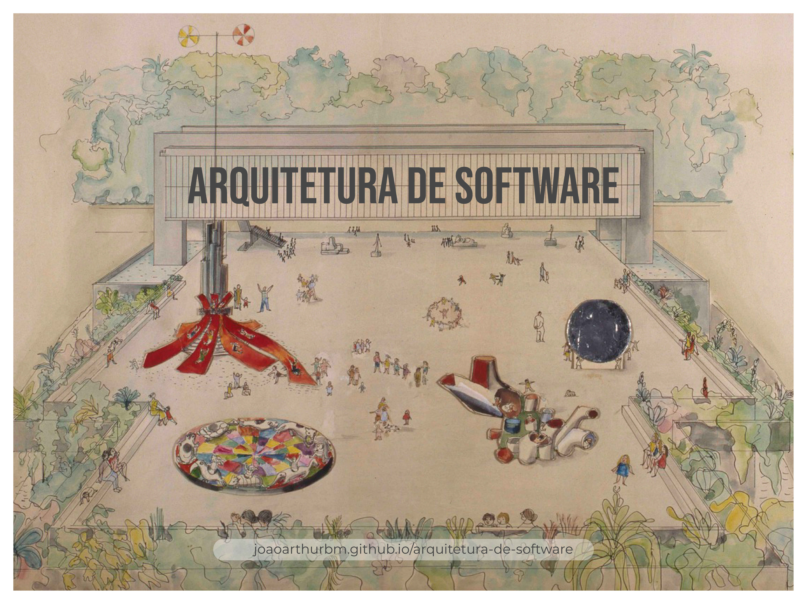

 </img>

joao.arthur@computacao.ufcg.edu.br

<a style="position: fixed; bottom: 2%; font-size:12px" href="http://joaoarthurbm.github.io/arquitetura-de-software">joaoarthurbm.github.io/arquitetura-de-software</a>
---

# Apresentação do curso

### Antes de mais nada

Sua conta @ccc é o que identifica você. Portanto, tudo que envolve a disciplina deve ser feito através dela. 

 

Sua primeira tarefa é colocar um avatar na sua conta @ccc. Me ajuda a saber quem você é.

---

# Comunicação

<blockquote> De novo, sempre com seu email @ccc.</blockquote>

 

<b>Material?</b> Concentrado no classroom.

<b>Comunicação?</b> Slack.

<b>Encontros síncronos?</b> google meet.

- Entre com o microfone desligado.
- *Pode/deve* me interrromper enquanto falo.

---

# O modelo a distância

<blockquote><b>Exige mais de mim</b> e de você.</blockquote>

## Eu

- Preciso produzir melhores conteúdos: texto, vídeo, exercícios, guias etc. Slide, que já era secundário, passa a ser quase irrelevante.

- Assumo também o papel de curador de conteúdo já existente.

- Preciso elaborar, corrigir e dar feedback sobre muito mais exercícios do que o convencional.

- Preciso criar roteiros de estudo para você. 

- Aumentar a interação fora do horário reservado para a disciplina.

- Coordenar mais monitores do que o comum.

Obs.: Isso não significa que não era preciso fazer antes, mas o encontro em sala de aula amenizava algumas deficiências nesses pontos.

---

# O modelo a distância

<blockquote><b>Exige mais</b> de mim e <b>de você</b>.</blockquote>

## Você

- Precisa ler e escrever mais. Vários dos materiais que disponibilizo (sejam autorais ou não) são textos longos, relatórios, análises etc. 

- Precisa ser mais independente.

- Precisa ter rotina de estudo. Eu faço o plano, você executa. Minha sugestão é separar horários exclusivos e fixos para isso. 

- Precisa ser <b>mais proativo</b>. Perguntar, perguntar e perguntar. Para mim, para os monitores, para os colegas, para o google...

---

# O modelo a distância

<blockquote> A ética é exigida por construção, não assegurada por fiscalização.</blockquote>

### Cabe a você assumir também a responsabilidade pela sua formação.

As avaliações são *online*. Eu não vou filmar ninguém, nem registrar ações da tela de ninguém. 

---

# O modelo a distância

### Este curso exige de você:

- Capacidade de trabalhar em equipe;
- Proatividade para identificar projetos open source, participar da comunidade e contribuir concretamente via Pull Requests;
- Tempo de dedicação para leitura e escrita;
- Tempo de dedicação para preparação e apresentação de relatórios.

---

# Sobre o curso

<a href="https://joaoarthurbm.github.io/arquitetura-de-software/conteudo/">https://joaoarthurbm.github.io/arquitetura-de-software/conteudo/</a>

### Três grandes módulos

- Introdução à arquitetura de software
- Estilos e Padrões Arquiteturais
- Avaliação e verificação arquitetural

---

# Objetivos de aprendizagem

<a href="https://joaoarthurbm.github.io/arquitetura-de-software/objetivos/">joaoarthurbm.github.io/arquitetura-de-software/objetivos/</a>

Ao final deste curso você será capaz de:

- Debater sobre diferentes definições de arquitetura de software;
- Descrever a arquitetura de sistemas utilizando o modelo C4 e o modelo de visões arquiteturais;
- Identificar, compreender e escrever sobre os principais estilos e padrões arquiteturais;
- Compreender, aplicar e propor métodos de avaliação arquitetural.

---

# Como?

<a href="https://joaoarthurbm.github.io/arquitetura-de-software/metodologia/">joaoarthurbm.github.io/arquitetura-de-software/metodologia/</a>

Várias iterações de três etapas:

- Aulas expositivas e casos da indústria

- Desafios e oficinas

- Apresentação dos mini-projetos

---

# Plano de Aulas

<iframe class="center" height=400 width=100% src="https://docs.google.com/spreadsheets/d/e/2PACX-1vTZDsXsOqJCTvCGp-gUHu-3a4XkF31AY9WC7XALElPSqR0UgFDtjIs3BOGpQgB98_4KGsFhXjXzpHve/pubhtml?gid=2016649157&amp;single=true&amp;widget=true&amp;headers=false"></iframe>

---
# Avaliação

As <b>listas de exercícios</b> serão baseadas no conteúdo teórico disponibilizado e discutido nos nossos encontros virtuais.

Para os <b>mini-projetos</b>, vocês deverão apresentar relatórios descrevendo detalhadamente o que foi pedido. Essas atividades são baseadas nos sistemas open source que estudaremos. Iremos documentar a arquitetura desses sistemas, discutir suas decisões arquiteturais, propor e avaliar mudanças, além de outras atividades.

- Módulo 1: 3 listas de exercícios (30%) + mini-projeto (70%)

- Módulo 2: 3 listas de exercícios (30%) + mini-projeto (70%)

- Módulo 3: 3 listas de exercícios (30%) + mini-projeto (70%)

---

# Bibliografia

<a href="https://joaoarthurbm.github.io/arquitetura-de-software/bibliografia/">joaoarthurbm.github.io/arquitetura-de-software/bibliografia/</a>

### Básica

Brown, Simon. The art of visualising software architecture: communicating software architecture with sketches, diagrams and the C4 model.

Rozanski, Nick, and Eóin Woods. Software systems architecture: working with stakeholders using viewpoints and perspectives. Addison-Wesley, 2012.