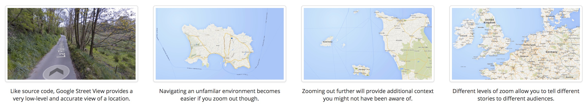
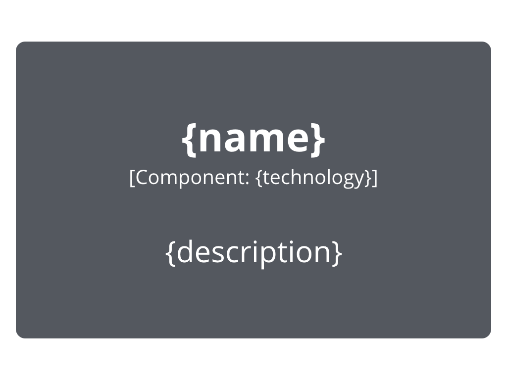

background-image: url(figures/c4-livro.png)

### O Modelo C4 para Visualização de Arquitetura de Software

---

# A metáfora dos mapas

- Diferentes níveis de detalhes.
- Diferentes visões.
- O foco inicial está na estrutura estática.

---

## C4: <b>C</b>ontexto, <b>C</b>ontainers, <b>C</b>omponentes e <b>C</b>ódigo

---

# Nível 1: Diagrama de Contexto

---

# Nível 2: Containers

- Containers: algo implantável.
	- *single-page application*, *datastore*, aplicação desktop, aplicação mobile, microserviços, aplicação do lado do servidor... 

---

# Nível 3: Componentes

- Componentes: abstrações com responsabilidades específicas, coesas e delimitadas.
	- Componente de envio de email, componente de segurança, componente de estatísticas, *controllers*, fachadas... 

---

# Nível 4: Código

- Proximidade com o design de baixo-nível.
	- Classes, interfaces, padrões de projeto...

---

# Alguns outros diagramas

### Diagrama dinâmico

???

Descreve como os elementos estáticos colaboram em tempo de execução para implementar um caso de uso / user story / requisito funcional.

Semelhante ao diagrama de sequência ou de comunicação de UML.

---

# Alguns outros diagramas

### Diagrama de implantação

???

Mapeia os containers para elementos de hardware.
---

# Notação

<figure>

<figure>

<figure>

</figure>

<figure>

<figure>

<figure>

</figure>

???

O texto tem um papel importante na notação c4.

---

# Notação

<figure>

</figure>

---

# Um caso concreto: Parlametria

Serviço no twitter para um sistema já desenvolvido.

<figure>

</figure>

???

O objetivo do sistema é analisar e monitorar discursos de deputados no twitter. Além de interagir com o twitter, interage também um sistema desenvolvido previamente para monitorar outros aspectos dos deputados.

Primeiro aspecto importante: não há interação com pessoas. Trata-se de um sistema ou sub-sistema que irá fornecer informações ao Leggo.

Poderíamos ver como um container dentro do contexto do parlametria? Sim. Como já discutimos várias vezes, não há fórmula exata.
---

# Um caso concreto: Parlametria

Serviço no twitter para um sistema já desenvolvido.

<figure>

</figure>

---

# Um caso concreto: Parlametria

Serviço no twitter para um sistema já desenvolvido.

<figure>

</figure>

---

# Um caso concreto: Parlametria

Mais detalhes: <a style="font-size:20px" href="https://docs.google.com/document/d/1V3LzmH-uhWgbTMHvlyv3UDklVGQk4AWA5B518_LnN0o/edit?usp=sharing">documento de descrição arquitetural.</a>

---

# Referências

<figure>

<figure>

	

- https://c4model.com/
- https://www.infoq.com/articles/C4-architecture-model