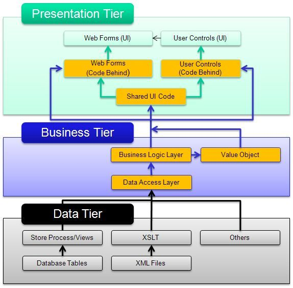
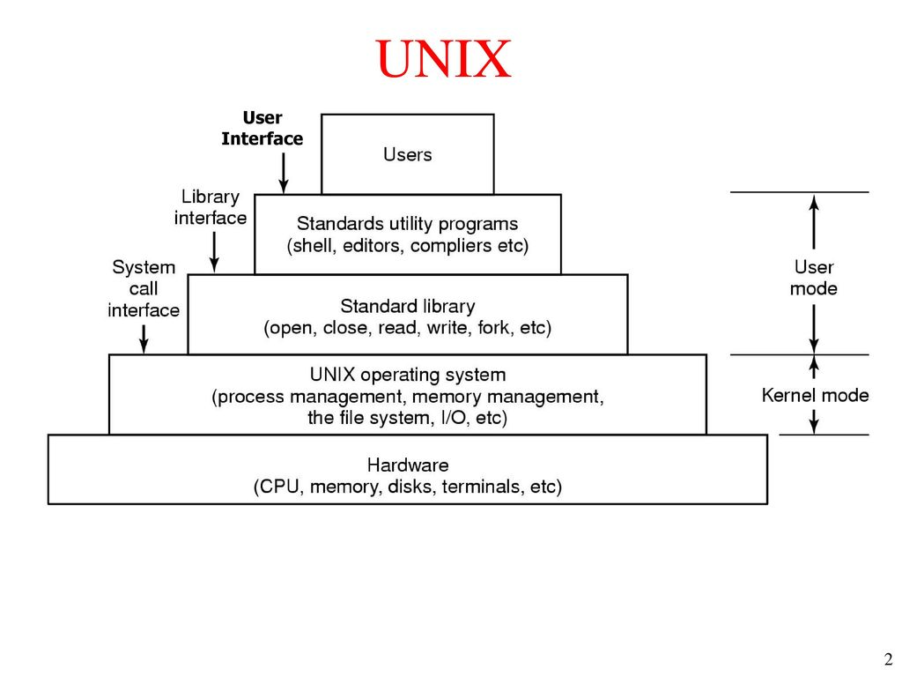
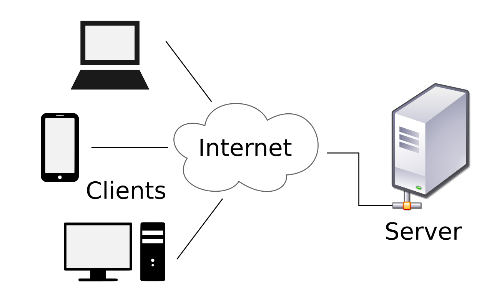
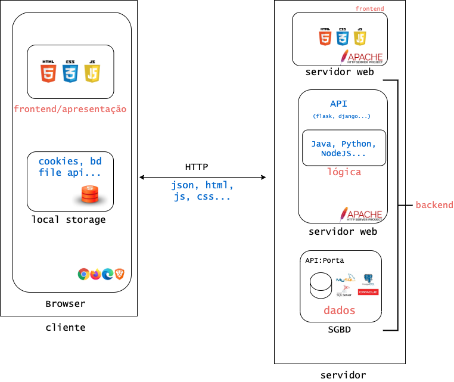
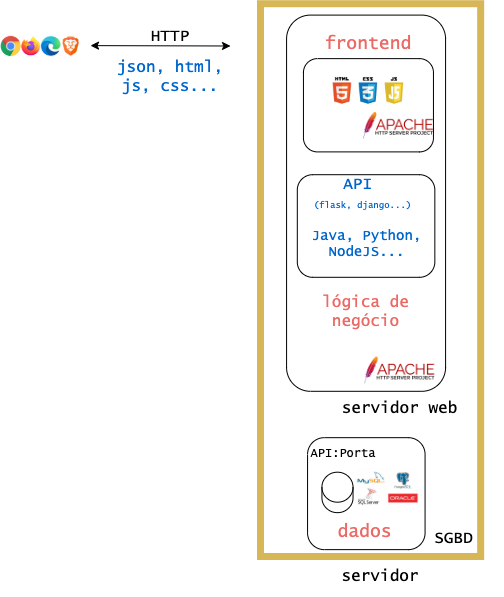
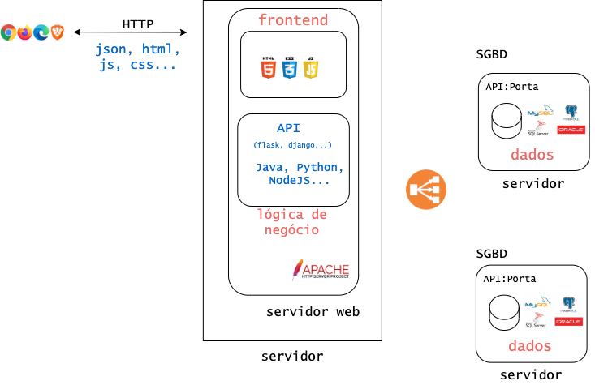
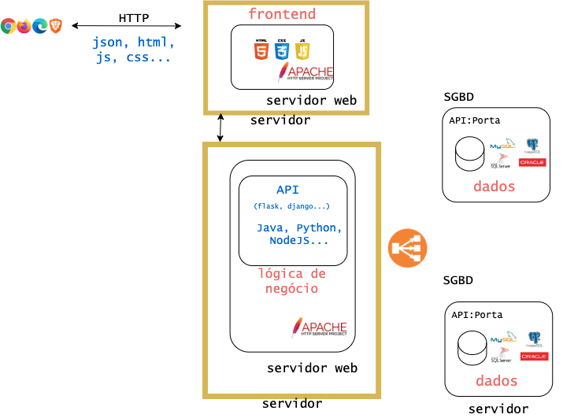
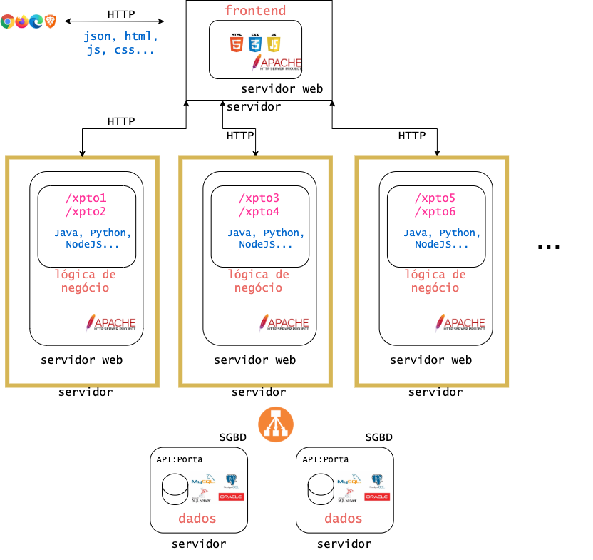
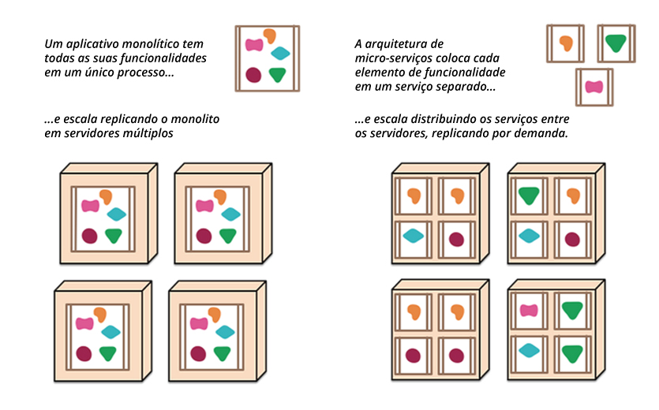

background-image: url(figures/capa.jpg)

# Estilos e Padrões Arquiteturais

joao.arthur@computacao.ufcg.edu.br

<a style="position: fixed; bottom: 3%; font-size:18px" href="http://joaoarthurbm.github.io/arquitetura-de-software">joaoarthurbm.github.io/arquitetura-de-software</a>

---

# Relembrando...

### O que é arquitetura de software?

Partes, responsabilidades e relacionamentos. 

--

A <b>organização</b> disso tudo.

---

# Estilos e Padrões Arquiteturais

Modos/Modelos/Formas de organização padrão.

--

<b>Padrões</b>. Soluções gerais para problemas recorrentes.

<b>Estilos</b>. Definem um modelo de organização estrutural. Não necessariamente resolvem um problema, mas dizem respeito à organização dos componentes de um sistema ou de parte dele.

--

<blockquote>
Camadas, MVC, peer-to-peer, pipes and filter, blackboard, cliente-servidor, cliente-serviço, broker, microkernel, microsserviços, serverless, publish-subcribe, plugins, REST...  
</blockquote>

---

## Estilos e Padrões Arquiteturais: por que?

<blockquote>
It's all about the <b>fundamental concepts</b>.
</blockquote>

*Baixo acoplamento, alta coesão, protocolos e interfaces bem definidos, concisão, responsabilidades bem definidas, separação de preocupações, separação de lógica, apresentação e dados...*

---

# Arquitetura em camadas

Separação lógica (layers) e/ou física (tiers) de responsabilidades em camadas com interfaces bem definidas.

<figure>

<figcaption class="center"> Three-tier architecture</figcaption>
</figure>

---

# Arquitetura em camadas

Arquitetura multicamadas. Separação lógica e/ou física (layers/tiers) de responsabilidades em camadas com interfaces bem definidas.

---

# Arquitetura em camadas

Arquitetura multicamadas. Separação lógica e/ou física (layers/tiers) de responsabilidades em camadas com interfaces bem definidas.

---

# Arquitetura em camadas

Regras gerais:

- Camadas independentes.
- Camada **n** só conhece a interface da camada **n - 1**.
- Comunicação entre camadas deve ser muito bem definida. Evitar acoplamentos desnecessários.
	- Protocolos padrões (http, gRPC...)
	- Padrões de projeto para diminuir acoplamento (Observer, visitor...)

Contudo, há exceções. Stackoverflow acessa a camada de dados diretamente da camada de apresentação para fins de desempenho.

---

# Arquitetura em camadas

<blockquote>
It's all about the <b>fundamental concepts</b>.
</blockquote>

- Alta Coesão.
- Baixo Acoplamento.
- Interfaces bem definidas.
- Independência.

Conceito usuado em vários níveis do sistema e por outros padrões. MVC é uma organização em camadas, por exemplo.

---
# Analisando algumas aplicações...

Processadores de texto, sistemas de pequenos negócios, editores de vídeo etc.

- Monolitos e na máquina do usuário: interface + lógica + dados.
- Não requer conexão com outra máquina.

--

Mesmo esses sistemas, hoje em dia, possuem alguma interação com servidores/outras máquinas.

---
# Cliente - servidor

---
# Cliente(e) - servidor(es)

- Aplicação distribuída
- Clientes
	- iniciam comunicação.
	- requisições ao servidor.

- Servidores
	- disponibilizam conteúdo ou serviços.
	- esperam por requisições.
	- modelo de fila.

---

# Cliente(s) - servidor(es)

Vamos analisar caracaterísticas de algumas aplicações que conhecemos?

- Dropbox
- Twitter
- Internet banking (celular)
- Declaração de Imposto de Renda

Perguntas a serem respondidas:

- Onde está a apresentação? A lógica? E os dados?
- Quem é servidor? O que serve?
- Quem é cliente? O que requisita?
- Como se dá a comunicação?

### Discussão

- Modelo 2 camadas vs. 3 camadas
- Relação com a terminologia frontend e backend

---

# Cliente(s) - servidor(es)

Tipicamente, envolve centralização. Portanto, há preocupações inerentes a essa característica:

- Balanceamento de carga;
- Escalabilidade;
- Tolerância à faltas\falhas;
- Disponibilidade;
- Trabalho "offline";
- Cache;

---

## Um pouco sobre aplicações web modernas

---

# Monolitos

Todas as funcionalidades em um só lugar.

---
# Monolitos: vantagens

- Simplicidade
- Desempenho. Não envolve chamadas a diferentes servidores (diminui latência).
- Processo de deploy simplificado.
- Monitoramento simplificado.

---
# Monolitos: desvantagens

- Ponto único de falha.
- Processo de deploy pode ser demorado.
- Complexidade na organização da equipe.
- Base de código tende a ser grande.
- Escalabilidade: vertical pode ser cara e horizontal envolve duplicação total.

---
# Monolitos: o caso do Stackoverflow

<iframe width="560" height="315" src="https://www.youtube.com/embed/cFCW6VX0y74" frameborder="0" allow="accelerometer; autoplay; clipboard-write; encrypted-media; gyroscope; picture-in-picture" allowfullscreen></iframe>

---
# Um primeiro movimento

Escalar horizontalmente a camada de dados.

---

# Um segundo movimento

Separar fisicamente frontend de backend.

O que isso me permite?

---

# Um terceiro movimento: microsserviços

Separar funcionalidades/serviços.

---

# Um quarto movimento: microfrontends

Aplicar o conceito de microsserviços para o frontend.

<iframe class="center" width="560" height="315" src="https://www.youtube.com/embed/HdxJI_wHGDM" frameborder="0" allow="accelerometer; autoplay; clipboard-write; encrypted-media; gyroscope; picture-in-picture" allowfullscreen></iframe>

https://martinfowler.com/articles/micro-frontends.html

https://micro-frontends.org/

---
# Monolito vs. Microsserviços

<figure>

<figcaption class="center">https://www.thoughtworks.com/pt/insights/blog/microservices-nutshell</figcaption>
<figure>

---

# Microsserviços

<blockquote>Lei de Conway: projetos de sistemas refletem a organização das estruturas de comunicação da empresa.</blockquote>

- Independência.
- Favorece desenvolvimento por múltiplos times com habilidades e background diferentes.
- Favorece coesão de serviços.
- Favorece manutenção.
- Escalabilidade horizontal apenas para os serviços que precisam.
- Falha em um serviço não interrompe o sistema.
- Implantação separada.

<b>De novo. Conceitos fundamentais.</b> Alta coesão, baixo acoplamento, interfaces bem definidas, separação de preocupações... 

---

# Microsserviços: preocupações

- Complexidade

- Latência. Cadeia de chamadas de serviços pode causar alta latência.

- Dificuldade na governança. O que pode ser bom, pode também ser ruim: equipes separadas, tecnologias diferentes, padrões diferentes...

---

