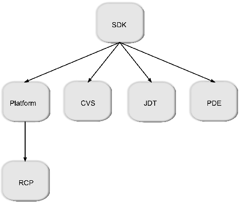
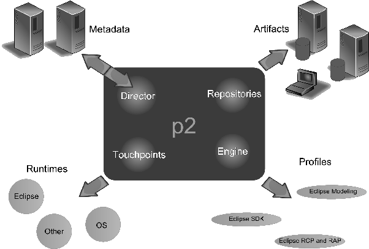
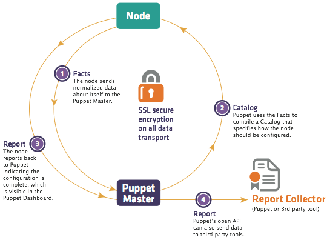
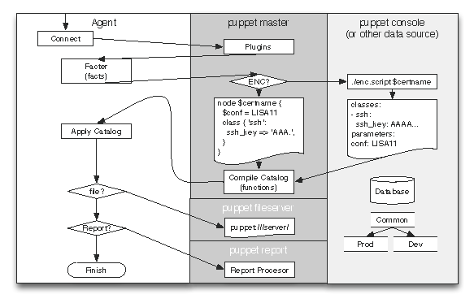
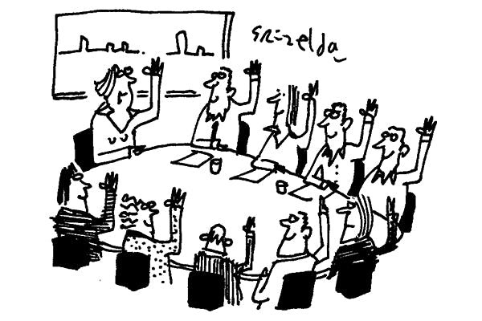
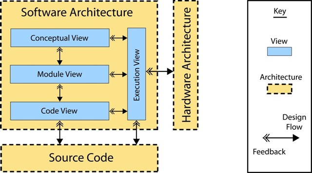
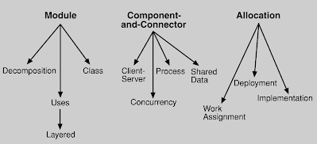
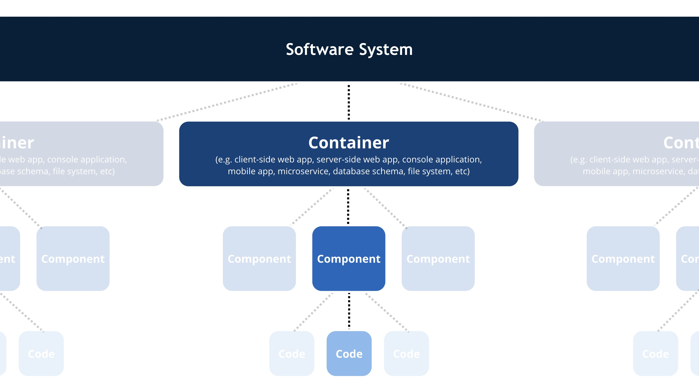
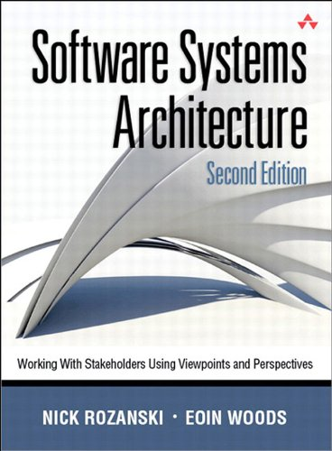

background-image: url(figures/capa.jpg)
---

# O Desafio de Sally

???

Sally é a responsável pelo projeto de uma atualização importante no sistema da empresa. Há uma demanda para que o sistema passe a **processar os pedidos em tempo real.** Essa demanda vem da área de negócio da empresa, porque o sistema começou a perder mercado por não ser tão ágil quanto os concorrente, uma vez que o processamento dos pedidos são efetuados em *batch*.

Sally então precisa ter reuniões com os responsáveis pelo negócio da empresa. É preciso entender de fato qual é o problema e quais os **requisitos de negócio** que serão abordados pela solução técnica.

Depois dessa primeira conversa, Sally passa a elaborar um projeto. Parece simples, mas Sally é experiente e sabe que há muito mais interessados (**stakeholders**) no meio do caminho com diferentes **preocupações**. Por exemplo, gerentes não precisam das informações detalhadas, mas precisam de um resumo das transações. Contudo, essa atividade atrasará o fluxo principal das operações, o que parece ser inadmissível pelo pessoal de logística. Além disso, os responsáveis pela implementação e operação estão preocupados com a adoção de uma tecnologia e também não acreditam que o servidor de aplicação escolhido por Sally seja adequado. Uma outra preocupação é trazida pelos auditores: é preciso ter um backup de ao menos dois anos de todas as transações realizadas, o que demanda muita capacidade de armazenamento e processamento.

Este é o trabalho de Sally. Projetar uma solução técnica que implemente o requisito conciliando as preocupações de diferentes *stakeholders*. Sally é uma arquiteta de software. 

Aqui é importante também lembrar que o trabalho de Sally está diretamente relacionado com o triângulo-tradeoff custo, qualidade e tempo de entrega.

Note que o trabalho de Sally não se resume a escutar e projetar. Ela precisa comunicar suas decisões com esses diferentes stakeholders. Isso significa que a linguagem muda de um contexto para o outro, pois o nível de especificação também muda. Não adianta, por exemplo, apresentar aspectos tecnológicos e com descrição em linguagens de modelagens formais para o pessoal de negócio. Da mesma forma, os responsáveis pelo desenvolvimento da solução se comunicam com linguagens e padrões diferentes dos responsáveis pela implantação e operação do sistema. Em resumo, há diferentes visões sobre o problema e essas visões são documentadas de maneira diferente.

O conceito de **visão arquitetural** é o que nos permite documentar diferentes ângulos do mesmo problema para diferentes pessoas. Para escolher e definir as visões, uilizamos **pontos de vista**, que são templates com diretrizes para criar as visões. 

Visões e Pontos de Vista são excelentes recursos para descrever a estrutura da arquitetura, os padrões utilizados e decisões tomadas. Contudo, descrever o modo como os atributos qualitativos (requisitos não-funcionais) são implementados/abordados não é uma tarefa simples, pois são tipicamente preocupações ortogonais, que são difícieis de serem capturadas em uma visão.
Por isso, lançamos mão de **Perspectivas**. Uma perspectiva arquitetural é semelhante a uma visão/ponto de vista, mas ao invés de descrever aspectos estruturais, aborda um atributo de qualidade em particular, por exemplo, segurança, desempenho etc.

# Resumo do caso de Sally

- <b>Mudanças significativas</b> em um sistema já implantado.
	- tecnologias, estratégias, infraestrutura, estilos/padrões, modo de implantação e operação etc.

- Mudança provocada pelo negócio.

- <b>Requisitos não-funcionais</b> norteando as decisões.

- <b>Diferentes interessados</b> na mudança com <b>diferentes preocupações</b>.

- Preocupações por vezes conflitantes. O triângulo-tradeoff custo, 
qualidade e tempo para entrega.

---

# Resumo do caso de Sally

- <b>Mudanças significativas</b> em um sistema já implantado.
	- tecnologias, estratégias, infraestrutura, estilos/padrões, modo de implantação e operação etc.

- Mudança provocada pelo negócio.

- <b>Requisitos não-funcionais</b> norteando as decisões.

- <b>Diferentes interessados</b> na mudança com <b>diferentes preocupações</b>.

- Preocupações por vezes conflitantes. O triângulo-tradeoff custo, 
qualidade e tempo para entrega.

---

# O Desafio da *bxblue*

<a href="https://engineering.bxblue.com.br/post/1.post-mortem-escalando-um-servidor-rails/"> 
<figure>

<figcaption class="center">
	link para o post
</figcaption>
</figure>
</a>

???

# Contexto

Empresa: financeira.

O problema: o tráfego de um dos produtos **dobrou** de uma semana para outra. A demanda crescia a cada dia. O motivo do aumento é relacionado ao negócio/produto.

Fraquezas identificadas:

- Requisições síncronas demorando. Obstrução da fila.
- Tempo de resposta aumentando e atingindo threshold.
- Jobs assíncronos com pouca vazão.

Uma discussão importante que surge aqui é: por que não pensar nesse cenário antes e preparar o sistema para isso?

Não foi esse o caso. A infra era bem planejada, simples e, principalmente, barata. Isso foi suficiente para o negócio até que fosse preciso evoluir. Detalhe importante aqui: arquitetura não é estática. Evolução faz parte. 

Além disso, há de se pensar na relação entre as variáveis custo, tempo, qualidade e time to market.

Os autores citam Donald Knuth: "Premature optimization is the root of all evil."

# Primeira ações

O negócio não pode parar. Prejudicaria os clientes. 

Ação: comprar mais processamento e memória. Aumentar recursos computacionais (escalar horizontalmente?).

Essa ação recuperou temporariamente o negócio e deu fôlego para resolver o problema de maneira mais barata, ou seja, mudando o software e sua operação.

Neste momento já estava claro para a equipe que a solução era otimizar o processamento das requisições e que isso poderia ser aplicado através de um melhor  gerenciamento de processos e threads.

Além ter conhecimento sobre o problema e sobre a possível solução, há também o claro domínio sobre a tecnologia (Puma): a equipe sabia que o servidor permitia o gerenciamento do número de workers (processos) e do número de threads por worker.

# A Solução

Até o problema ocorrer, havia apenas um worker rodando com 5 threads. Solução óbvia? Aumentar o número de workers e threads. Aqui há um cuidado muito importante que o arquiteto deve tomar: 

<blockquote>
	Tradeoff: Mais workers significa mais consumo de memória e mais threads significa mais espera pelo lock do interpretador.
</blockquote>

## Primeiro passo: aumento de workers e threads

- 2 workers com 5 threads cada. 
- Simples: editar apenas um arquivo.

## Segundo passo: otimizar escalonador de jobs

Aqui o caso é parecido. Havia apenas uma thread sendo processada por vez. A solução foi aumentar esse número.

# Avaliação

- Processo contínuo.
- Processo iterativo.
- Processo investigativo. 
- Relatos diários

	- Dia 1. Já foi observada melhora na vazão, com o impacto de 25/30% a mais de uso de memória. Embora tenha sido um bom resultado, em alguns momentos o limiar era atingido e o sistema passava a fazer swap, o que fez com que a latência fosse prejudicada.
	
	- Dia 2. Diminuição dos processos para evitar swap. Não deu certo, pois quando havia 20 threads executando, o sistema todo ficava lento.
	
	- Dia 3. 2 processos. Menos threads. 1 dyno. Problemas semelhantes ao iniciais. Aumento para 2 dynos. Ou seja, um processo com 5 threads por dyno. Ainda foi observado alguns problemas. Contudo, a solução parecia não passar mais pelo controle de processos e threads, mas por investigar chamadas bloqueantes.

	**Uma chamada a uma API externa durava de 2 a 3 minutos!** Bloqueava todas as threads e, por consequência, a aplicação.

# Solução para a API

- Timeout.
- Impedir chamadas em tempos de intermitência.

# Alguns pontos importantes

- Mudanças com o software implantado.
- Requisito não funcional.
- Impacto no negócio.
- Solução inicial rápida, porém cara.
- Solução mais definitiva: melhor gerenciamento de processos e threads.
- Lidar com tradeoff.
- Processo investigativo.
- Processo de avaliação contínuo das mudanças arquiteturais.
- Problema principalmente gerado por API externa. Talvez pudesse ter sido detectado antes do início da solução. Aqui é importante o papel do perfilamento, que não deixa de ser avaliação arquitetural.
- Documentação de todo o processo em um relato *post mortem.*

---

# Resumo do caso *bxblue*

- Mudanças em sistema já implantado.

- Mudança provocada pelo negócio.

- Requisitos não-funcionais (vazão e latência) norteando as decisões.

- <b>Tradeoff</b>: solução inicial rápida, porém cara. Solução mais definitiva: melhor gerenciamento de processos e threads.

- Mudanças na operação do sistema.

- Processo investigativo e iterativo.

- Processo de avaliação contínuo das mudanças arquiteturais.

- Problema era gerado por API externa. Talvez pudesse ter sido detectado com perfilamento inicial.

- Documentação de todo o processo em um relato *post mortem.*

---

# O que é arquitetura de software?

#### <b>Palavras-chave</b> importantes até agora

<blockquote>Decomposição e orquestração das partes do sistema; impacto do/no negócio; requisitos não-funcionais norteando decisões; tradeoff; processo investigativo; estratégias; diferentes visões; avaliação do impacto das decisões; documentação das decisões; custo; qualidade; tempo; time-to-market...</blockquote>

---
# O que é arquitetura de software?

<blockquote>Não há definição única de Arquitetura de Software.</blockquote>

???

Arquitetura de Software é um conceito chave na área de Engenharia de Software e vem sendo discutida com mais profundidade desde a década de 90, quando vários pesquisadores concentraram-se em definir e explorar suas diversas formas de especificação e representação.

Embora muito esforço tenha sido empregado, não existe atualmente uma definição universal de Arquitetura de Software. Pesquisadores e engenheiros de software divergem no conteúdo, na forma e em que momento a arquitetura deve ser especificada. De fato, atualmente, a abordagem mais aceita é a que relativiza o papel da arquitetura. Isto é, não existe ‘A arquitetura’, mas sim um conjunto de visões arquiteturais que abordam os pontos de interesses de diferentes stakeholders.

---

## Arquitetura de Software: partes e relacionamentos

<blockquote>Arquitetura é um conjunto de <b>partes</b> que compõem o sistema e o <b>ambiente</b> em que está inserido, suas <b>responsabilidades</b> e seus <b>relacionamentos</b>.</blockquote>
 

- *Partes*: containers, componentes, pacotes, subsistemas, camadas...

- *Ambiente*: infraestrutura, stakeholders, configuração...

- *Responsabilidades*: não-funcionais e funcionais

- *Relacionamentos*: interação entre as partes

???

### Partes

Algumas diferentes visões sobre o mesmo conjunto de artefatos estão em jogo aqui. Neste momento vamos detalhar mais os elementos de software, por enquanto.

Não quero encerrar a discussão do que é um componente, um módulo ou pacote. O importante é termos noção de que estamos falando de uma parte (*chunk*) de software e como ela se relaciona com as outras partes. Vamos chamar de componente como sinônimo de parte, não de componente formalmente definido em Engenharia de Software.

Esses componentes precisam ter alta **coesão** e precisam ser acopladas umas às outras de maneira adequada.

Alta Coesão: o componente é formado por elementos fortemente relacionados. O Componente faz **uma** coisa e faz bem.

Acoplamento: os componentes devem ser acoplados de maneira adequada. Acoplamento alto dificulta a manutenção, pois aumenta o efeito "gelatina".

Outras perspectivas, pontos de visão e visões que veremos com mais detalhes tentam responder as questões:

* Como esses elementos interagem com o ambiente. Onde e como serão implantados?

* Qual é o fluxo da informação? Como é gerenciada, armazenada e apresentada?

* Que funcionalidades serão providas?

* E do ponto de vista do processo de desenvolvimento e implantação?

Os pontos de vista, visões arquiteturais e perspectivas arquiteturais serão assunto para as próximas aulas. Contudo, o que estou querendo deixar claro aqui é que há diferentes aspectos da arquitetura que interessam a diferentes stakeholders.

### Ambiente

O software é implantado e executa em plataformas, sevidores etc. Pessoas interagem com o software. Outros sistemas também. É sobre isso que estamos falando quando usamos o termo ambiente. É parte importante da arquitetura definir esse ecossistema porque permite a diferentes stakeholders ter noção exata do que, como e onde estão os seus pontos de interesse.

### Relacionamentos

As partes precisam se relacionar. Não somente as partes relacionadas ao software, mas ao hardware e, inclusive, stakeholders. Faz parte da arquitetura também descrever como se dão esses relacionamentos. Os protocolos utilizados nessa comunicação definem o modo como as interações são realizadas, bem como suas capacidades e limitações.

Stakeholder é o nome dado a qualquer pessoa ou organização que é relacionada ou está interessada no projeto. Isso inclui arquiteto, analista, desenvolvedor, cliente, usuário, entre outros.

---
name: definicao
## Arquitetura de Software: partes e relacionamentos

<blockquote>Arquitetura é um conjunto de <b>partes</b> que compõem o sistema e o <b>ambiente</b> em que está inserido, suas <b>responsabilidades</b> e seus <b>relacionamentos</b>.</blockquote>

Na prática...

---
template: definicao

<a href="http://aosabook.org/en/eclipse.html" style="position:absolute;left:33%">The Architecture of Open Source Applications: Eclipse.</a>

---
template: definicao

<a href="http://aosabook.org/en/eclipse.html" style="position:absolute;left:33%">The Architecture of Open Source Applications: Eclipse.</a>

---

template: definicao

<a href="http://aosabook.org/en/eclipse.html" style="position:absolute;left:33%">The Architecture of Open Source Applications: Eclipse.</a>

---

template: definicao

<a href="http://aosabook.org/en/puppet.html" style="position:absolute;left:33%">The Architecture of Open Source Applications: Puppet.</a>

---

template: definicao

<a href="http://aosabook.org/en/puppet.html" style="position:absolute;left:33%">The Architecture of Open Source Applications: Puppet.</a>

---

## Arquitetura de Software: conjunto de decisões

<blockquote>Arquitetura é um conjunto de <b>decisões firmes</b> e de <b>grande impacto</b>.</blockquote>
 

- Linguagens, persistência, integração, padrões, estilos, protocolos de comunicação, interfaces etc.

- Princípios, diretrizes e estratégias.

--
count: false

???
Os termos-chave aqui são "firmes" e "grande impacto". Uma decisão arquitetural é uma decisão estratégica e não se altera facilmente sem haver profundas discussões sobre o seu custo e impacto. 

*Exemplo.* Decidir por usar o estilo arquitetural REST é uma decisão arquitetural. Com o software em evolução, trocar de estilo/padrão é uma mudança complexa e de alto impacto.

*Exemplo.* Adotar um modelos relacional ao invés de um modelo não-relacional para gerenciar os dados é também uma decisão arquitetural porque tem profundo impacto em como o software será implementado e mantido.

*Exemplo.* Definir as interfaces dos subsistemas é uma decisão arquitetural. Os serviços que serão expostos devem ser cuidadosamente definidos e, se constantemente modificados, podem geram impacto muito grande em outros sussistemas e componentes que se relacionam com o mesmo.

*Exemplo.* A escolha de uma estrutura de dados **não** é uma decisão arquitetural. Embora importante para o projeto de baixo-nível, essa escolha não tem um impacto global no sistema. Ainda, caso seja necessário trocar uma lista por um mapa, por exemplo, a mudança não é cara do ponto de vista codificação, testes e impacto em outras partes do sistema. Por fim, poucos stakeholders (talvez só alguns desenvolvedores) são impactados por essa mudança.

---

## Arquitetura de Software: requisitos não-funcionais como norte

<blockquote>Requisitos não-funcionais norteiam decisões arquiteturais.</blockquote>
 

Desempenho, manutenabilidade, escalabilidade, segurança, latência, tolerância à falhas, reuso, entre outros.

- Cache e suas estratégias
- MapReduce
- MVC
- Microsserviços
- Escalabilidade horizontal
- Balanceamento de carga
- ...

???

Decisões arquiteturais são tomadas tendo como norte o atendimento a requisitos não-funcionais/ atributos qualitativos. 

<blockquote>The architecture you choose for your system dictates how quickly it runs, how secure it is, how available it is, how easy it is to modify, and many other nonfunctional factors, which we collectively term quality properties. Designing a system that exhib- its acceptable quality properties is a crucial part of your role as an architect.</blockquote>

*Exemplo.* Optar por utilizar o MVC tem como motivação separar a lógica de negócio da apresentação e do fluxo da aplicação. Essa motivação tem uma razão de existir. 
É mais fácil manter e evoluir código cuja separação entre módulos é clara e cujos módulos são coesos. Ou seja, favorece a manutenabilidade.

*Exemplo.* Adotar uma estratégia de cache é uma decisão que está relacionada ao desempenho e latência.

*Exemplo.* Adotar microsserviços é uma decisão relacionada a vários atributos de qualidade. Por exemplo, impacta na manutenção e evolução do sistema porque permite que diferentes times evoluam separadamente os diferentes serviços oferecidos pelo sistema. Impacta também na testabilidade do sistema, pois permite testes em serviços isolados e, por consequência, mais simples. Também permite que uma indiponibilidade em um serviço não resulte na indisponibilidade de todo o sistema. Além disso, a implantação de um mesmo serviço pode ser feita em diferentes servidores para favorecer a escalabilidade do sistema.

*Exemplo.* Adotar MapReduce para processamento de parte dos dados é uma decisão relacionada ao desepenho.

---

## Consenso

<blockquote>Há consenso sobre o que importa e sobre não existir um único modelo para representar a arquitetura.</blockquote>
 

--
count: false

<b>O que importa?</b> Estrutura, responsabilidades, relacionamentos, decisões, padrões, diretrizes e atendimento a atributos de qualidade.
 
 
<b>Representação?</b> A arquitetura é vista e especificada em diferentes formas, variando de acordo com os <i>stakeholders</i>. Por exemplo, os pontos de interesse dos desenvolvedores são, certamente, diferentes dos projetistas e analistas. 

???
Essa concordância vem da impossibilidade de se descrever a arquitetura seguindo um único modelo ou, em outras palavras, uma única visão. Nesse modelo de visões arquiteturais, a arquitetura é vista e especificada em diferentes formas, variando de acordo com os stakeholders. Por exemplo, os pontos de interesse dos desenvolvedores são, certamente, diferentes dos projetistas e analistas.

É importante destacar, contudo, que as várias definições não são conflitantes do ponto de vista conceitual. De fato, há uma convergência sobre o que importa: estrutura, responsabilidades, relacionamentos, decisões e atendimento a atributos de qualidade.

---

# Visões Arquiteturais

<blockquote>É inviável documentar a arquitetura em um único artefato.</blockquote>
<b>Documentação é comunicação.</b>
 

Copyright @ 2008 by Bredmeyer Consulting

???

Um único modelo seria muito confuso e teria que abordar muitos aspectos que são irrelevantes dependendo do stakeholder. Para agradar muitos, acabaria não agradando ninguém.

<b>Documentação é comunicação.</b> Deve ser direta, concisa, coesa e ter público alvo bem definido.

---

# Visões Arquiteturais

<blockquote>Há diferentes visões sobre a arquitetura.</blockquote>
 

<b>Kruchten, Philippe B. "The 4+ 1 view model of architecture." IEEE software, 1995.</b>

<b>D. Soni et. al. "Software architecture in industrial applications". ICSE, 1995.</b>

<b>Bass et. al. "Software architecture in practice." Addison-Wesley Professional, 2003.</b>

--

Perguntas importantes:

- Como o software é decomposto do ponto de vista estrutural?
- Como se dá a comunicação dos componentes, bibliotecas e subsistemas em tempo de execução?
- Como os elementos de software se relacionam com elementos do ambiente (e. g. hardware)?

???

A ideia de entender a arquitetura como um conjunto de visões arquiteturais não é nova. Em 1974, Parnas já entendia a arquitetura como um conjunto de várias estruturas parciais e que o sistema é o conjunto dessas várias estruturas. Desde então esse conceito parte-todo permeia os relatos teóricos e práticos na área. Em 1995, Kruchten publicou um artigo influente descrevendo o modelo de visões aplicado na Rational Software. Esse modelo possui 4 visões principais e uma adicional que une essas principais: o modelo 4 + 1. As visões definidas são:

**Visão Lógica.** Essa visão captura as abstrações (classes, interfaces etc) e seus relacionamentos. Tipicamente utiliza-se diagramas de classes e de estado para descrever esses elementos. Muitas vezes envolve as principais abstrações do sistema que estão relacionadas com o domínio do problema e os padrões de baixo-nível utilizados, por exemplo, Observer, Strategy, entre outros.

**Visão de Processo.** Lida com aspectos dinâmicos do sistema, o que inclui, em essência, o controle da execução do sistema. Detalhes relacionados à concorrência, controle de threads, distribuição e tolerância à falhas são preocupações que devem ser descritas nesta visão.

**Visão de desenvolvimento.** Contempla a visão do desenvolvedor sobre o sistema. Está muito relacionada ao gerenciamento do software. A organização dos módulos, bibliotecas e subsistemas é uma das principais preocupações descritas nesta visão, que se utiliza de diagramas de componentes e de pacote para tal fim.

**Visão Física.** Pode ser vista como a visão de deploy do sistema. Nos dias atuais, o stakeholder nessa visão seria o *devops*, uma vez que ele controla onde os elementos de software serão executados. Essa visão mostra, por exemplo, em quais e quantos servidores os dados estão distribuídos e em que máquinas os serviços estão executando.

A quinta visão é a que, de certa forma, une todas as outras. Isso é feito através de Casos de Uso. Além de explicitarem requisitos funcionais, Casos de Uso capturam também requisitos para a arquitetura e, portanto, podem estar relacionados a mais de uma visão.

Durante a mesma época, engenheiros da Siemens também publicaram o modelo de visões arquiteturais utilizado na empresa. Nesse modelo há 4 visões: conceitual, visão de módulos, visão da execução e visão do código. 

**A visão conceitual** descreve as principais abstrações de alto-nível do projeto e seus relacionamentos. Nessa visão é muito comum utilizar "componente-conector" para descrever os elementos de interesse. O objetivo é apresentar os módulos de alto-nível e como se dá a comunicação entre eles. Essa visão é independente de implementação. 

 A **visão de módulos** descreve como os módulos são decompostos, isto é, decomposição funcional e camadas. Essa visão deixa claro as decisões que foram ou serão tomadas durante a implementação. Estamos falando aqui de estilos arquiteturais, por exemplo.

 A **visão de execução** descreve os aspectos dinâmicos do software, como threads, tarefas e processos. A preocupação aqui está nos atributos de qualidade como desempenho, escalabilidade e monitoramento. 

Por fim, **a visão de código** descreve como o código, bibliotecas e subsistemas estão organizados no ambiente de desenvolvimento.

Houve também um esforço do Instituto de Engenharia de Software (SEI), documentado no livro *Software Architecture In Practice*, para definição de visões arquiteturais que capturam o modelo arquitetural.  Na verdade, o termo usado é Tipos de Visão (Viewtypes). *Viewtypes* definem um conjunto de elementos e de relacionamentos que são usados para descrever a arquitetura de um determinado ponto de vista. Podemos pensar em Viewtypes como um metamodelo para as visões. Nessa contexto, há 3 grandes preocupações:

- Como o software é decomposto do ponto de vista estrutural?

- Como se dá a comunicação dos componentes, biblitecas e subsistemas em tempo de execução?

- Como os elementos de software se relacionam com elementos do ambiente (e. g. hardware)?

Ou seja, as unidades de implementação, as unidades de execução e o mapeamento dos elementos de software nos elementos de hardware.

As visões propostas são: módulo, componentes e conectores e alocação.

**Módulo.** Representa a visão estrutural da arquitetura. Aqui são descritas as abstrações e os relacionamentos entre essas abstrações. Essa visão responde a primeira pergunta acima.

**Componentes e Conectores.** Descreve os aspectos comportamentais da arquitetura. Processos, tasks, threads e objetos são colocados em perspectiva, além da forma como se comunicam. Essa visão responde a segunda pergunta acima.

**Alocação.** Descreve o mapeamento dos processos nos elementos de hardware. Essa visão é semelhante à visão física do modelo 4 + 1. Essa visão responde a terceira pergunta acima.

---

# Os Modelos que adotaremos

<figure>

<figcaption>
https://c4model.com/
</figcaption>
<figure>

<figure>

<figcaption>Viewpoints, Views, and Perspectives.</figcaption>
</figure>

???

# Perguntas na prática

Quais são os principais componentes e como se comunicam?
Onde esses componentes, módulos e subsistemas estão implantados?
Como a informação é gerenciada, armazenada e apresentada?
Como os atributos de qualidade são abordados?

---

# Mais referências

*Clements, Paul, et al. Documenting software architectures: views and beyond. Pearson Education, 2002.*

*Amy Brown and Greg Wilson (editors). The Architecture of Open Source Applications. Volumes 1-2, 2012.*

*Bass, Len, Paul Clements, and Rick Kazman. Software architecture in practice. Addison-Wesley Professional, 2003.*

---

# Nosso vocabulário

<blockquote>Arquitetura: estrutura das estruturas de um sistema, o que compreende os elementos de software, as propriedades externas visíveis desses elementos e os relacionamentos entre eles.</blockquote>

*Estruturas estáticas, estruturas dinâmicas, propriedades externamente visíveis,
propriedades qualitativas, requisitos não-funcionais, padrões arquiteturais, estilos arquiteturais, stakeholders, visões, pontos de vista, perspectivas, preocupações, sketches arquiteturais...*

???
Estruturas estáticas definem os elementos internos do projeto e seus relacionamentos. Exemplos desses elementos são: classes, pacotes, componentes, stored procedures, serviços, tabelas do esquema de banco de dados, discos, cpu etc. Sketches de camadas, diagramas de classes, pacotes e implantação são exemplos de recursos para descrever estruturas estáticas.

Estruturas dinâmicas definem os elementos de "tempo de execução" e suas interação. Por exemplo, fluxo de dados, troca de mensagens, invocação de rotinas, serviços, criação e manipulação de dados etc. Diagramas de sequência e de fluxo de dados são exemplos clássicos de formas de especificação de elementos "runtime".

Propriedades externamente visíveis são àquelas que dizem o que o sistema faz do ponto de vista de um observador externo. Estamos falando aqui essencialmente dos requisitos funcionais, dos contratos de APIs, entre outros.

Propriedades qualitativas diz respeito essencialmente aos requisitos não-funcionais do sistema. Estamos falando aqui de desempenho, segurança, escalabilidade etc.

**Exercício.** Crie perguntas que um arquiteto deve fazer e que estejam relacionadas com cada um desses conceitos.

- Que estilo arquitetural adotar? Quais são as camadas do sistema?
- Como o sistema se comporta com uma carga constante de 100 requisições por segundo?
- Como o sistema autentica seus usuários?
- Que troca de mensagens é realizada entre os subsistemas de autenticação e registro?
- Onde estão implantados os serviços responsáveis por cadastro de usuários?
- O sistema permite relocação de carros?
- Qual o tempo de resposta médio nos horários de pico?
- Como estão separados os elementos de apresentação dos elementos de lógica de negócio?

---

# Considerações Finais

No curso vamos tratar de arquitetura de sistemas e arquitetura de software. Daremos mais ênfase à arquitetura de software, mas também trataremos, quando preciso, de elementos da arquitetura do sistema como um todo e de seus subsistemas.

Descrição arquitetural apresenta as estruturas do sistema e como essas estruturas se relacionam.

Arquitetura diz respeito às decisões firmes de projeto.

Requisitos não-funcionais influenciam fortemente as decisões arquiteturais.

Não há descrição única da arquitetura. Há diferentes visões com diferentes preocupações.

Não há sistema sem arquitetura. As decisões estão lá.