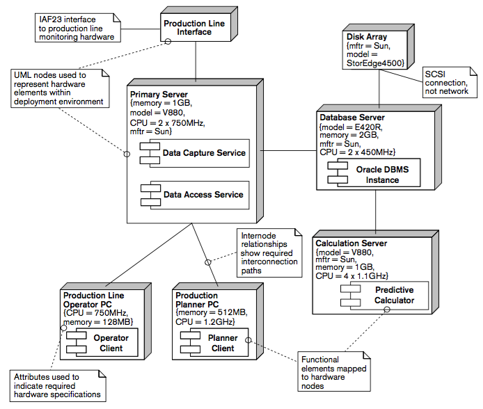

background-image: url(figures/capa.jpg)

 
# Arquitetura de Software

 
 
 
 
 
 
 
 
 
 
 

 
### Visões, Pontos de Vista e *Sketches* arquiteturais
joao.arthur@computacao.ufcg.edu.br
---

# Relembrando

<blockquote>É inviável documentar a arquitetura em um único artefato.</blockquote>
<b>Documentação é comunicação.</b>
 

Copyright @ 2008 by Bredmeyer Consulting

---

# Visões Arquiteturais

Viewpoints, Views, and Perspectives.

---

# Visões e Pontos de Vista

Uma **visão arquitetural** é a descrição de um aspecto do sistema.

**Ponto de vista** é uma coleção de padrões, templates e convenções que servem de guia para a construção das visões.

???

Aqui é importante frisar o conceito de divisão e conquista. As visões são criadas porque diminuem o problema. Juntas elas são capazes de descrever a arquitetura.

Pontos de vista agregam conhecimento legado para a construção de descrições arquiteturais. Há sim formalismos envolvidos, por exemplo, UML como linguagem de descrição pode uniformizar a maneira de descrever determinados aspectos da arquitetura. Contudo, na prática há uma heterogeneidade na maneira de descrever aspectos arquiteturais.

---

# Pontos de vista

- **Funcional**, **Informação** e **Concorrência** caracterizam a organização fundamental do sistema;
 
 
- **Desenvolvimento** existe para apoiar a construção do sistema; e
 
 
- **Implantação** e **Operação** caracterizam o sistema uma vez implantado em seu ambiente de execução.

???

O modelo de visões/pontos de vista é flexível o suficiente para você não precisar descrever usar todos os pontos de vista, por exemplo. Essa é a vantagem de ter um modelo com visões independentes. Além disso, cabe ao arquiteto decidir, em conjunto com stakeholders, o que e quanto descrever.

---

# Funcional

<blockquote>Descreve os elementos funcionais do sistema, suas responsabilidades, interfaces e relacionamentos. Tipicamente é o primeiro aspectos que stekeholders estão interessados.</blockquote>

---

# Funcional: visão geral

Preocupações: interfaces externas, organização interna e conceitos de projeto.

Modelos: Funcionais.

Problemas e armadilhas: interfaces e responsabilidades mal definidas, infraestrutura modelada como elementos funcionais, muitas dependências, *"god" elements* etc.

Stakeholders: todos.

Aplicabilidade: todos os sistemas.

---

# Funcional: elementos

**Elementos funcionais:** parte bem definida do sistema com uma responsabilidade particular e interface bem definida. Exemplo: módulo responsável por login, módulo reponsável por log etc.

**Interfaces:** define as funções que podem ser acessadas por outros elementos. Definem entrada, saída e semântica das funções.

**Conectores:** pedaços da arquitetura que permite a conexão entre dois elementos. A diferença para a interfaces é que conectores são complexos o suficiente para demandarem uma especificação mais detalhada. 

**Entidades externas:** outros sistemas, programas, dispositivos, serviços que estão além da fronteira do sistema.

**Exemplo de Notação formal:** diagrama de componentes.

---

# Funcional: Monitor

Importante: nem todos os exemplos são bons exemplos de descrição funcional. Vamos discutí-los um a um.

Copyright - 2005 by Eoin Woods and Nick Rozanski

---

# Funcional: Webshop

Copyright - 2005 by Eoin Woods and Nick Rozanski

---

# Funcional: Webshop

UML não é a única forma. Na verdade, vamos trabalhar com Sketeches Arquiteturais. Lembre-se: o objetivo é **comunicar**. Notação é meio, não fim.

---

# Funcional: Bash

Copyright - 2005 by Eoin Woods and Nick Rozanski

---

# Funcional: Eclipse

Este é um bom modelo funcional?

Copyright - http://aosabook.org/en/eclipse.html

---

# Diretrizes para descrição da visão funcional

- Identifique os componentes -- elementos de alto-nível com responsabilidades claras.

- Identifique os relacionamentos desses elementos -- dependência, generalização, composição, uso, chamada etc.

- Diferencie grupos de componentes com diferentes formas.

- Especifique protocolos de comunicação, quando possível/preciso.  

- Seja consistente na notação. Componentes e relacionamentos similares devem ter a mesma forma.

- Evite modelar infraestrutura na visão funcional.

- Cuidado para não tornar essa visão a visão de todas as outras.

---

# Por que esta não é uma boa descrição?

Copyright - 2005 by Eoin Woods and Nick Rozanski

???

O que esse modelo comunica?

Não sabemos que componentes existem no servidor.

O que significa as linhas pontilhadas?

Elementos de hardware que não cabem como funcionais.

Aparentemente há uma decomposição em APPServer. Não sabemos qual, nem quais foram as decisões de projeto.

Muito importante: atente-se para as descrições funcionais.

---

# Decisões ruins

Por que este modelo denuncia decisões ruins?

Copyright - 2005 by Eoin Woods and Nick Rozanski

--

Vamos discutir um pouco sobre "god components/packages/classes", acoplamento e coesão.

---

# Informação

<blockquote>Descreve o modo como a arquitetura armazena, manipula, gerencia e distribui informação.</blockquote>

---
# Informação: visão geral

Preocupações: estrutura, fluxo, controle de acesso, ciclo de vida, transações, qualidade, volume etc.

Modelos: diagrama de classes, diagrama de entidades e relacionamentos, diagrama de fluxo de dados, modelos estáticos de estruturas de dados, modelos de qualidade de dados etc.

Problemas e armadilhas: incompatibilidade, má qualidade, más definições de volume e esquemas.

Stakeholders: usuários, desenvolvedores, DBAs, entre outros.

Aplicabilidade: todo sistema que possui requisitos não-triviais de gerenciamento de informação.

---

# Informação: modelos estáticos de estruturas de dados

- Entidades
- Atributos
- Relacionamentos (associações)
- Cardinalidade

Copyright - 2005 by Eoin Woods and Nick Rozanski

---

# Informação: modelos estáticos de estruturas de dados

Copyright - 2005 by Eoin Woods and Nick Rozanski

---

# Informação: Twitter

Como seria?

---

# Informação: fluxo

Foco no movimento da informação. Quais são os principais elementos arquiteturais e como a informação flui entre eles.

Muito adequado para sistemas *data-intensive*.

---

# Informação: Diagrama de fluxo de dados

Notação: Setas, Retângulos, Retângulos abertos e Elipses.

Copyright - 2005 by Eoin Woods and Nick Rozanski

---

# Informação: Diagrama de máquina de estados

Copyright - 2005 by Eoin Woods and Nick Rozanski

---

# Informação: ePol

Copyright - 2020 by João Brunet

???

Este diagrama tem relação forte com as regras de negócio do sistema. No caso do ePol, foi alvo de longas e profundas discussões até ser especificado em sua forma final. 

Hoje o diagrama serve de referência concreta para comunicar o ciclo de vida de um inquérito policial.

---

# Diretrizes para descrição da visão de informação

- Indentificar as entidades centrais em um sistema.

- Não é necessário detalhar toda e qualquer informação. Se seu modelo tem mais de 20 entidades e não cabe em uma página, ele não irá servir para o seu propósito, isto é, não irá comunicar.

- Você até pode, mas deve evitar diagramas de baixo-nível.

- Detalhes como acesso podem ser expressados como tabelas e comentários.

- Evitar detalhes desnecessários.

---

# Concorrência

<blockquote>Descreve a estrutura de concorrência do sistema. Identifica partes do sistema que são executadas concorrentemente e apresenta o controle dessa concorrência.</blockquote>

Copyright - 2005 by Benjamin D. Esham

---

# Concorrência: visão geral

Preocupações: organização das tarefas, mapeamento de elementos funcionais às tarefas, comunicação entre processos, gerenciamento de estado, sincronização, tolerância à falhas etc.

Modelos: modelos de estados e concorrência.

Problemas e armadilhas: complexidade, deadlock e condições de corrida.

Stakeholders: desenvolvedores, testadores e administradores.

Aplicabilidade: sistemas concorrentes.

---

# Concorrência

Copyright - 2005 by Eoin Woods and Nick Rozanski

???

Não há uma notação padrão em UML. O que se faz é reusar componentes e pacotes e anotar identificando processos e threads, além da comunicação entre esses elementos.

---

# Concorrência

Copyright - 2005 by Eoin Woods and Nick Rozanski

---

# Concorrência

Copyright - 2005 by Eoin Woods and Nick Rozanski

???

Não é incomum o uso de diagrama de atividades.

---

# Diretrizes para descrição da visão de concorrência

- Seja consistente na notação.

- Identifique os estados.

- Identifique as transições e guardas.

- Se precisar detalhes, separe o ciclo de vida de algumas threads em outro modelo.

???

---

# Desenvolvimento

<blockquote>Modela a arquitetura que apoia o processo de desenvolvimento. </blockquote>

???

Aqui estão as decisões dos desenvolvedores e arquitetos em relação à organização do código. 

Abstrações, como elas estão organizadas e como se comunicação são as preocupações dessa visão. 

Aqui estamos falando de estilos e padrões arquiteturais.

---
# Desenvolvimento: visão geral

Preocupações: organização e decomposição dos módulos, padronização do projeto, padronização dos testes, organização do código-fonte.

Modelos: diagramas estruturais de módulos.

Problemas e armadilhas: muitos detalhes.

Stakeholders: desenvolvedores e testadores.

Aplicabilidade: todos os sistemas.

---

# Desenvolvimento

Copyright - 2005 by Eoin Woods and Nick Rozanski

---
# Desenvolvimento: ePol

Copyright - 2020 by João Brunet

---

# Desenvolvimento: perguntas

Na prática, focamos muito na organização em pacotes/módulos e na comunicação dessas partes. Contudo, outras perguntas são também importantes nessa visão:

- Como o código está organizado nos arquivos?
- Como os arquivos serão agrupados em módulos?
- Como será o build do código-fonte?
- Quais testes e como serão executados?
􏰀- Como será coordenado o desenvolvimento?

---

# Diretrizes para descrição da visão de desenvolvimento

- Identificar e classificar módulos e responsabilidades.

- Definir relacionamentos e dependências.

- Organizar visualmente as abstrações (camadas, por exemplo).

- Definir e explicitar regras entre camadas, grupos etc.

- Se precisar detalhes, separe o ciclo de vida de algumas threads em outro modelo.

---

# Implantação

<blockquote>Descreve o ambiente físico em que o sistema será implantado.</blockquote>

???

Aqui estamos falando das máquinas, servidores, balanceadores de carga, dispositivos de armazenamentos etc.

---

# Implantação: visão geral

Preocupações: hardware necessário, sistemas externos, compatibilidade de tecnologia, requisitos de rede, restrições físicas etc.

Modelos: diagramas de implantação.

Problemas e armadilhas: preocupação tardia com o ambiente, falta de especialistas, incertezas na especificação do ambiente, etc. 

Stakeholders: Devops, Administradores de sistema, desenvolvedores e testadores.

Aplicabilidade: sistemas com implantação não tivial.

---

# Implantação

Copyright - 2005 by Eoin Woods and Nick Rozanski

---

# Implantação: rede

Copyright - 2005 by Eoin Woods and Nick Rozanski

---

Bom exemplo de deployment: https://medium.com/@lawrence143/red-hat-openshift-google-cloud-reference-architecture-a11ee5c6989d

---

# Atividade

- Procurar por boas descrições funcionais em projetos open source.
- Procurar descrições que podem ser melhoradas. Apontar problemas e sugerir soluções.

